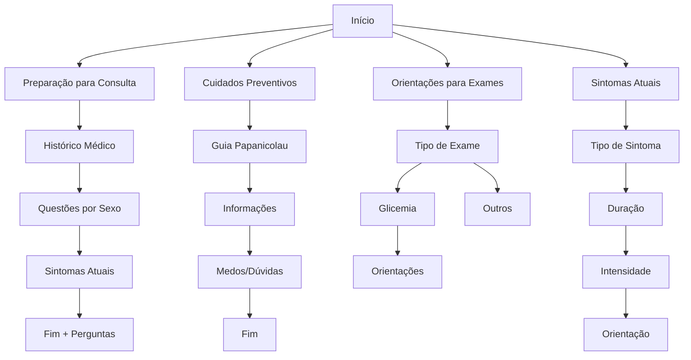

# 💡 Ilumino Health - Lançando luz sobre sua saúde

> Sistema de orientação em saúde desenvolvido durante o **Hackathon FGV - Congresso Internacional de Políticas Públicas em Saúde na Era da Informação**

[](https://github.com/drandreq/qds_ilumino)
[](LICENSE)

## 🎯 Sobre o Projeto

O **Ilumino Health** é uma aplicação Progressive Web App (PWA) que empodera pacientes com informações sobre sua própria saúde, facilitando a comunicação com profissionais de saúde e o preparo para consultas e exames.

**⚠️ Aviso Importante**: Este aplicativo é apenas para orientação sobre questões de saúde. De modo algum pretende substituir a consulta com enfermeiro e médico, apenas serve de suporte a questionamentos.

## 🏆 Equipe e Créditos

**Desenvolvido por:**
- **Dr. André Quadros** - Médico Programador | Health Evidence Tech Lead (Dasa)
- **Debora Cardoso**
- **Cristiano Coelho**

**Supervisão:**
- **Monique Flor**
- **Juliana Fiusa**

**Framework de business canva para políticas públicas:**
- **Rodrigo Narciso**

**Evento:** Hackathon FGV - Congresso Internacional de Políticas Públicas em Saúde na Era da Informação 2025

## 📊 Estrutura de Dados

O aplicativo utiliza uma estrutura de fluxos modulares:



## ✨ Funcionalidades

- ✅ **Fluxos de Orientação Personalizados**
  - Preparação para consultas (histórico médico estruturado)
  - Orientações para exames
  - Guia educativo do Papanicolau
  - Triagem de sintomas

- ✅ **PWA (Progressive Web App)**
  - Instalável em dispositivos móveis
  - Funciona offline
  - Experiência nativa

- ✅ **Persistência Local**
  - Salva progresso automaticamente
  - Retoma de onde parou após recarregar

- ✅ **Interface Premium**
  - Animações suaves (Framer Motion)
  - Design mobile-first
  - Feedback tátil (haptics)

- ✅ **Privacidade**
  - Não armazena dados pessoais em servidores externos
  - Processamento local no navegador
  - Sem login ou API

## 🚀 Como Usar Este Repositório

### Pré-requisitos

- Node.js 20+
- Docker e Docker Compose (opcional)

### Instalação Local

```bash
# Clone o repositório
git clone https://github.com/drandreq/qds_ilumino
cd qds_ilumino/frontend

# Instale as dependências
npm install

# Execute em modo desenvolvimento
npm run dev

# Acesse http://localhost:3000
```

### Instalação com Docker

```bash
# Na raiz do projeto
docker compose up -d

# Para rebuild sem cache
docker compose build --no-cache
docker compose up -d

# Acesse http://localhost:3000
```

## 🏗️ Estrutura do Projeto

```
qds_ilumino/
├── frontend/
│   ├── app/              # Páginas Next.js
│   │   ├── api/         # API Routes
│   │   └── page.tsx     # Página principal
│   ├── components/      # Componentes React
│   │   ├── TriageContainer.tsx
│   │   ├── QuestionCard.tsx
│   │   ├── Breadcrumbs.tsx
│   │   └── AnimatedTips.tsx
│   ├── lib/
│   │   └── data/        # Fluxos modulares
│   │       ├── consultation.ts  # Preparação para consulta
│   │       ├── exams.ts         # Orientações de exames
│   │       ├── preventive.ts    # Guia Papanicolau
│   │       └── tips.ts          # Dicas de saúde
│   └── public/          # Assets estáticos (manifest, icons)
├── LICENSE              # Licença MIT
└── README.md           # Este arquivo
```

## 🎨 Tecnologias

- **Next.js 16** - Framework React
- **TypeScript** - Tipagem estática
- **Tailwind CSS 4** - Estilização
- **Framer Motion** - Animações
- **PWA** - Progressive Web App

## 📝 Adicionando Novos Fluxos

Os fluxos são modulares e estão em `frontend/lib/data/`:

1. Crie um novo arquivo (ex: `dental.ts`)
2. Defina os passos usando a interface `Step`
3. Importe no `triageData.ts`

Exemplo:

```typescript
export const dentalFlow: Record<string, Step> = {
  'dental_start': {
    id: 'dental_start',
    type: 'question',
    inputType: 'choice',
    question: 'Qual procedimento odontológico você vai fazer?',
    summaryLabel: 'Procedimento Odontológico',
    options: [
      { label: 'Limpeza', value: 'cleaning', nextStepId: 'dental_cleaning' },
      // ...
    ]
  },
  // ...
};
```

## 🤝 Contribuindo

Contribuições são bem-vindas! Sinta-se à vontade para:

1. Fazer fork do projeto
2. Criar uma branch para sua feature (`git checkout -b feature/NovaFuncionalidade`)
3. Commit suas mudanças (`git commit -m 'Adiciona nova funcionalidade'`)
4. Push para a branch (`git push origin feature/NovaFuncionalidade`)
5. Abrir um Pull Request

## 🗺️ Roadmap futuro

- [ ] Sprint 4: Geração de relatório em PDF e alerta de sinais de gravidade do quadro atual
- [ ] Sprint 5: Acessibilidade (A11y audit)
- [ ] Sprint 6: Chatbot simples com IA para dúvidas livres e retroalimentação da FAQ

## 📄 Licença

Este projeto está sob a licença MIT. Veja o arquivo [LICENSE](LICENSE) para mais detalhes.

## 📱 Contato

- **GitHub**: [github.com/drandreq/qds_ilumino](https://github.com/drandreq/qds_ilumino)
- **Instagram**: [@dr.andreq](https://instagram.com/dr.andreq)

---

**Desenvolvido com 🫀🧠🤖 durante o Hackathon FGV 2025**  
**Powered by Human Intelligence 🧠 & Antigravity 🚀 with Gemini 3 🤖 & Claude Sonnet 4.5 🤖**
